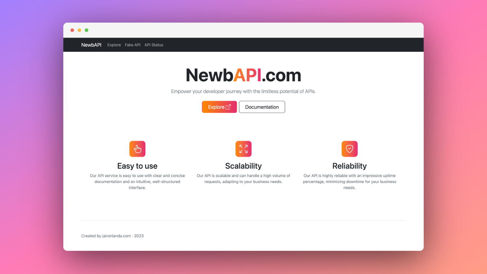

# NewbAPI Landing Page

<!--  -->

## What is NewbAPI?

NewbAPI is a powerful and user-friendly API service that offers a wide range of features designed to make it easy for developers to create and scale their applications. As an API service, NewbAPI provides a set of software tools and protocols that enable applications to communicate with each other seamlessly. This allows developers to leverage the functionality of existing services, such as databases or web applications, without having to build everything from scratch.

One of the key features of NewbAPI is its ease of use. Developers can quickly and easily integrate the API into their applications using a simple set of RESTful APIs. This means that even those with limited coding experience can start using NewbAPI to power their applications.

Another important feature of NewbAPI is its scalability. The API is designed to handle high traffic volumes and can easily scale up or down as needed. This means that developers can build applications that can handle millions of users without worrying about performance issues.

Reliability is another critical feature of NewbAPI. The API is built to handle large amounts of data, ensuring that developers can rely on it to provide accurate and up-to-date information. Additionally, NewbAPI provides 24/7 monitoring and support, ensuring that any issues are quickly resolved.

NewbAPI is available on the [RapidAPI Hub](https://rapidapi.com/user/newbAPIOfficial), the world's largest API hub. RapidAPI provides developers with a single API key and dashboard, making it easy to find, test, and connect to thousands of APIs. With over three million developers using RapidAPI, NewbAPI is a trusted and reliable option for those looking to leverage the power of APIs in their applications.

### APIs ⚙️
##### Freemium

| Status | API |
| ------ | ----------- |
| 🔴 Down | [QR Code Generator](#) 🚧 Coming Soon  |
| 🔴 Down | [Math Quiz](#) 🚧 Coming Soon |

### API Status

[Check](https://status.newbapi.com/status/free-api)

##### Free
| Status | API |
| --- | ----------- |
| 🟢 Active | [Planet Info](https://rapidapi.com/newbAPIOfficial/api/planets-info-by-newbapi/)  |
| 🟢 Active | [Placeholder API (1K Users)](https://newbapi.com/fake-api) |

### Available on

[newbAPIOfficial](https://rapidapi.com/user/newbAPIOfficial)

### Suggestion / Question / Help

👉🏼 [Jairon Landa](https://twitter.com/jaironlanda)
